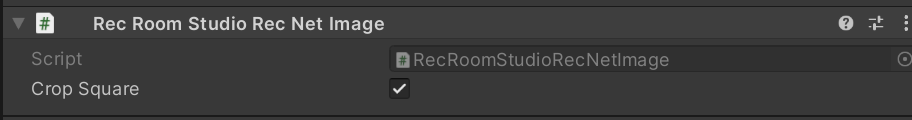
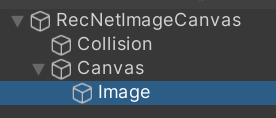
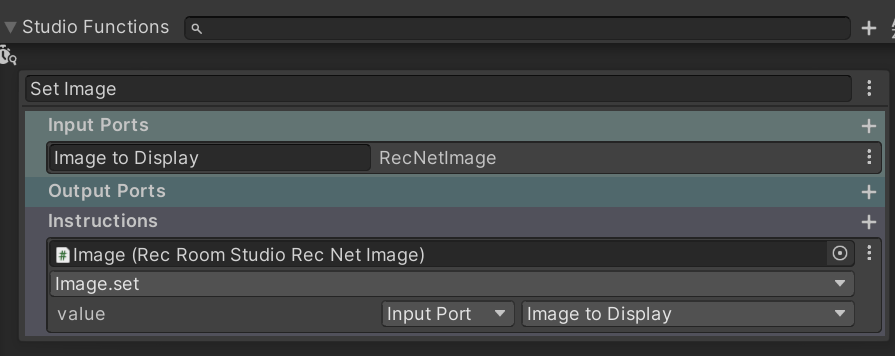
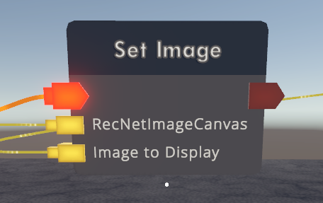

# RecNet Image Compoent

:::info
In the future, more chips will be added to support the `image` type for this component.
:::

### How to use RecRoomStudioRecNetImage component?

1. Step up your prefab like any other Rec Room Studio objects – make sure there’s Rec Room Object on the root and at least one collider.

2. Under the prefab hierarchy, make sure you add a **world space Canvas**

3. Under the Canvas, you can add objects and add **RecRoomStudioRecNetImage** component to them

:::note
**RecRoomStudioRecNetImage** will become the image once loaded in the RecRoom client, so you **do not need** additional Unity Image or Raw Image components on the same object. You can add an Unity image component to help you visualize the size when setting up the prefab. But make sure they are removed before you upload and build the room.

:::

4. In order to set the Image property on **RecRoomStudioRecNetImage** component, you’ll need to set up a Studio Function. An example would be:

5. Then in game with Circuits, you can use the Studio Function chip and other chips such as Inventory Item Get Definition that output an Image to display an image on this component.

