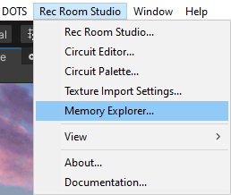
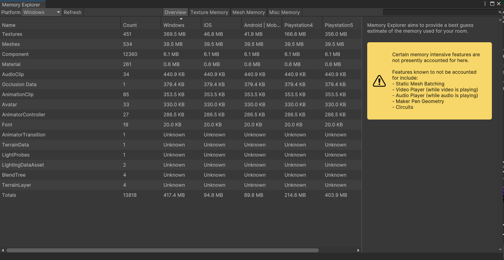
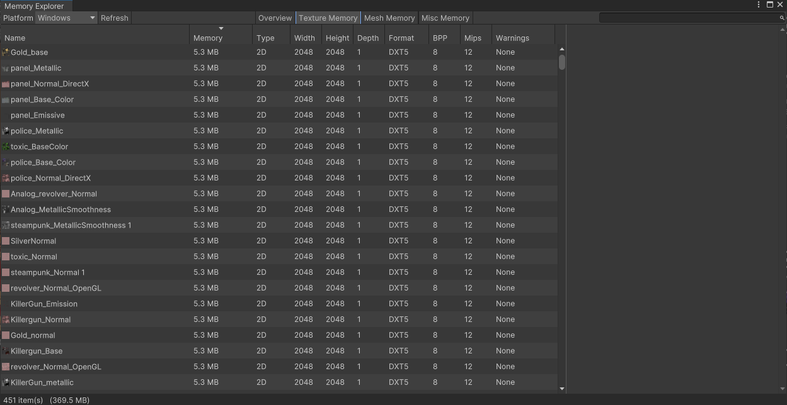
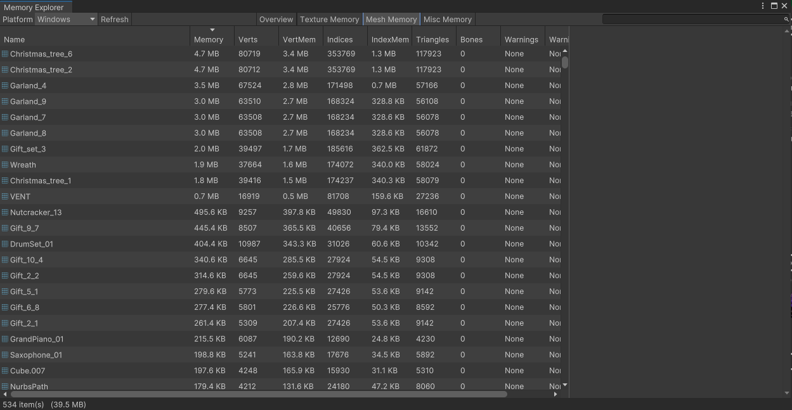
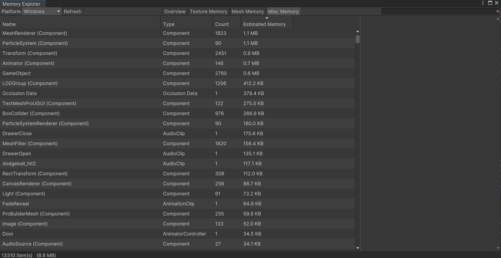
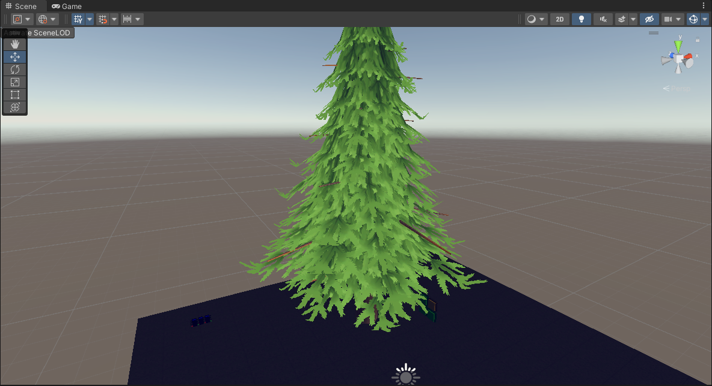
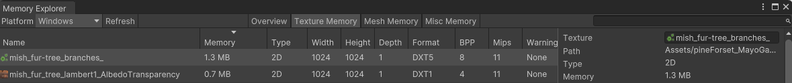
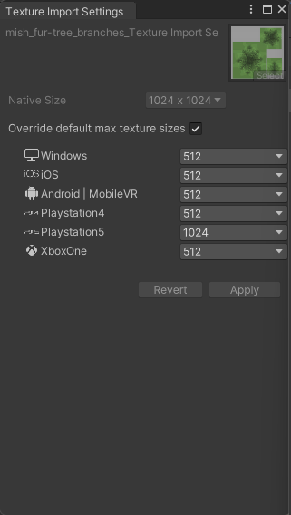
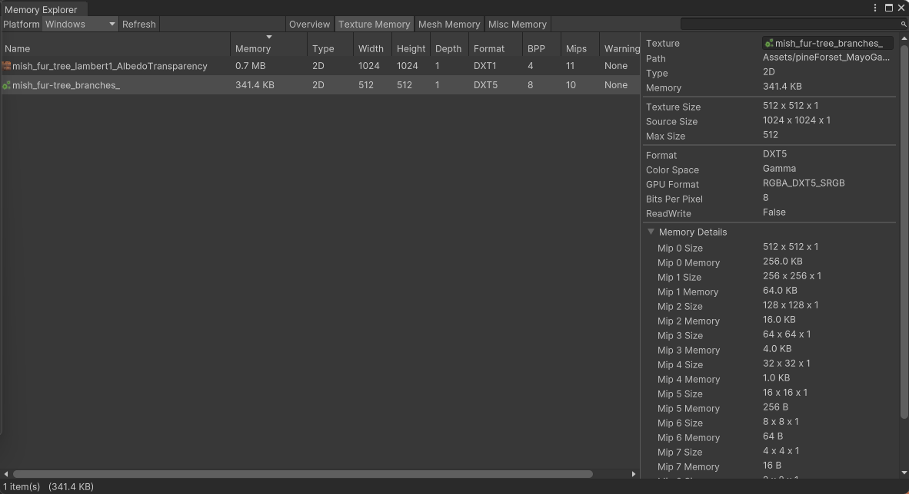

# Memory Explorer

The memory explorer allows a view into performance issues in your room and see what assets take up the most memory. 

Find and open the Memory Explorer by heading to the Rec Room Studio tab located at the top bar.

The Memory Explorer arranges room asset memory data into tabs, specific to each platform.

### Platform

Lets you choose the platform to preview memory usage on. The default is Windows.

### Overview

The Overview shows the count of measured categories of objects that take up memory, the asset count of that type, and an estimated total size of RRStudio assets in MB at the bottom, per platform.

### Texture Memory

Shows all textures assets used in the currently open room and how much memory each one takes. Use this info to find textures that will benefit from optimization. Select the platform with the dropdown on the upper left. Click on category names (Name, Memory, etc.) to sort the list by that category.

For more information about how to reduce the size of your texture to take up less memory, refer to the [Texture Import Tool](/docs/SavingRooms/PerformanceTools/TextureImportTool).

### Mesh Memory

The Mesh Memory tab shows the memory taken up by each mesh. Use this tab to identify meshes with high memory usage.

### Misc Memory

The Miscellaneous tab shows the memory taken up by various components like audio sources, animators, and particle mesh renderers.

Example

#### Simplifying Texture
1. I imported a tree into my room a simple mesh and a texture

2. After uploding it into Rec Room, the size of the tree texture ends up being 1.3MB

3. Using the [Texture Import Tool](/docs/SavingRooms/PerformanceTools/TextureImportTool) I reduced the size of the file from 1.3MB to 341.4KB on Windows

