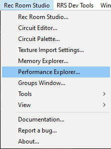
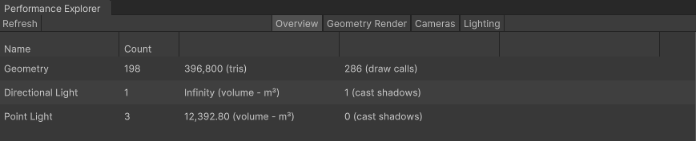
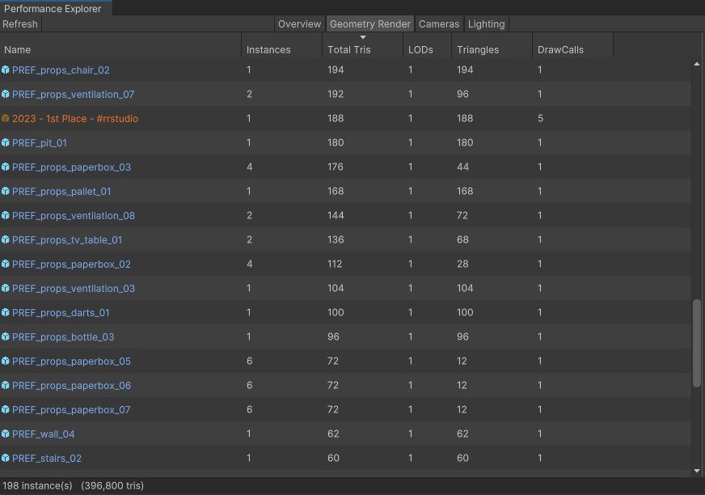
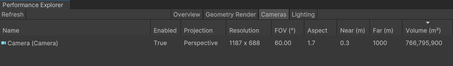
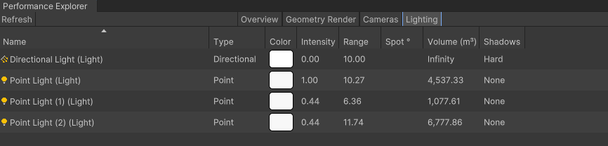

# Performance Explorer

The performance explorer allows you to see details about your room that will impact memory demand during runtime of your subroom. 

Find and open the Performance Explorer by heading to the Rec Room Studio tab located at the top bar.

The performance explorer provides a high-level overview of usage of features likely to contribute to the performance of your room.

### Geometry Render

The Geometry Render tab displays information about objects in your room, including Maker Pen Objects. Instances, total tris, LODs, draw calls and triangles. Instance is the number of times that object is used in your subroom. Tris and draw calls are important to reduce on objects with a large amount, or if they have many instances. If you find performance issues in your room with noticeably low framerate, reducing the Tris of meshes by editing it in a 3D sculpting program like Blender can help.

### Cameras

The Camera tab gives you insight on any cameras present in your room. It tells you if a camera is enabled, what type of projection it has, its resolution, Field Of View angle, aspect, near/far values and its volume. Because a Camera adds an additional set of rendering that must be done, Cameras can cause performance issues in rooms that utilize them. It’s recommended to have as few cameras as possible, have only one camera render texture active at a time for the local player, and to keep resolution and volume minimal..Settings for the Camera can be changed by selecting the Camera in the Hierarchy and making adjustments in the Inspector window for that Camera. <https://docs.unity3d.com/Manual/class-Camera.html>

### Lighting

The Lighting tab will help you find all lights in your room, their type, color, intensity, range, spot angle, volume and shadow setting. Lights can impact performance in many ways. To optimize, it’s recommended to put less than 4 lights covering the same area at once, this includes the Directional Light. You can change a light’s color from this explorer as well by selecting the color.

