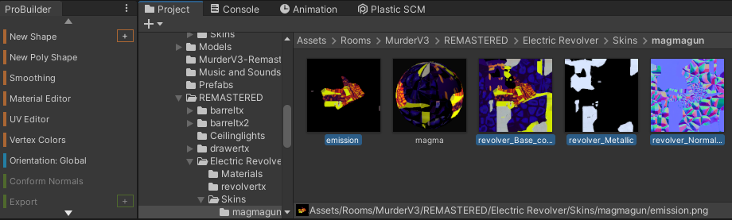
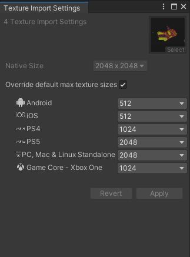

# Texture Import Tool

You can modify the format of a texture on each platform separately to optimize your room’s download size and performance. To do so:

First, select your textures you want to modify the resolutions of in the project explorer tab

Find and open the Texture Import Tool by heading to the Rec Room Studio tab located at the top bar.

In the Texture Import Settings tab, select “Override default max texture sizes” and choose the resolution you want for each platform type. Quest headsets go under the Android category.

Select “Apply” and wait for your textures to be modified. Unity shows the highest resolution set for any platform in the Scene View.