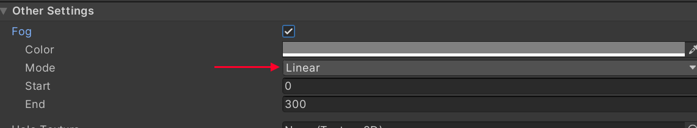
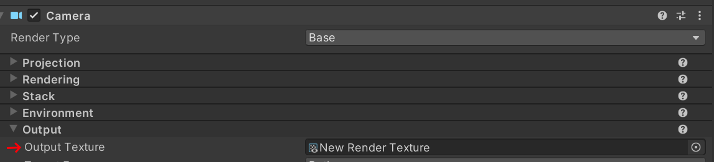

# Asset Validation

Whenever you hit Upload or Play, RRStudio runs a series of validation steps steps to help detect common issues with your room.

:::info

Asset validation rules will change over time.  It's possible that older rooms may have validation errors when re-uploading with a newer version.

:::

### Material &lt;mateiral&gt; uses an unsupported shader &lt;shader&gt;. Edit this material to use one of the Rec Room Studio shaders.{#invalid-material}

Rec Room Studio supports a limited number of shaders.  You must use one of the `Rec Room Studio/*` shaders.  Shaders like `Standard` or custom shaders & shader graphs are not supported.

See [Importing Unity Assets](/docs/BuildinginRRS/import#urp) for more information about updating your shaders.

### Baked Global Illumination is not supported. Turn it off in the Lighting Settings window. {#baked-global-illumination}

Rec Room does not support baked global illumination.  To disable it open the lighting panel (Window -> Rendering -> Lighting) and uncheck `Baked Global Illumination`

### Fog mode &lt;mode&gt; is not supported. Fog mode must be set to linear. Change this in the Lighting Settings window {#fog-mode}

Rec Room only supports linear fog mode.  To change the fog mode open the lighting panel (Window -> Rendering -> Lighting) and select the `Environment` tab, and under Fog, change the mode to `Linear`

### Cameras are only supported on Rec Room Objects. Please remove or disable the component on game object.{#cameras-rrobject}

Rec Room Studio supports cameras, but in order to prevent them from interfering with the main player camera, they must be part of a Rec Room Object prefab.  See [Creating Custom Rec Room Studio Objects](/docs/BuildinginRRS/custom) for details of how to create a Rec Room Object.

### Cameras must have an output texture set. Please set the output texture for the camera.{#cameras-rendertarget}

Cameras in Rec Room Studio must have a render target set to prevent them from interfering with the main player camera.  

Create a RenderTexture asset and assign it as the Camera's Output Texture. 

:::caution
 Keep the resolution as low as feasible for performance.  We recommend no larger than 1024x1024, and smaller is better.
:::

### Camera property '\{property}' must be set to '\{value}' on prefab.\{#cameras-properties}

Certain camera properties must be set to specific values for performance and/or stability purposes.

| Property       | Required Value  |
| ---------      | --------------  |
| Stop NaNs      | false           |
| Anti-aliasing  | No Anti-aliasing|
