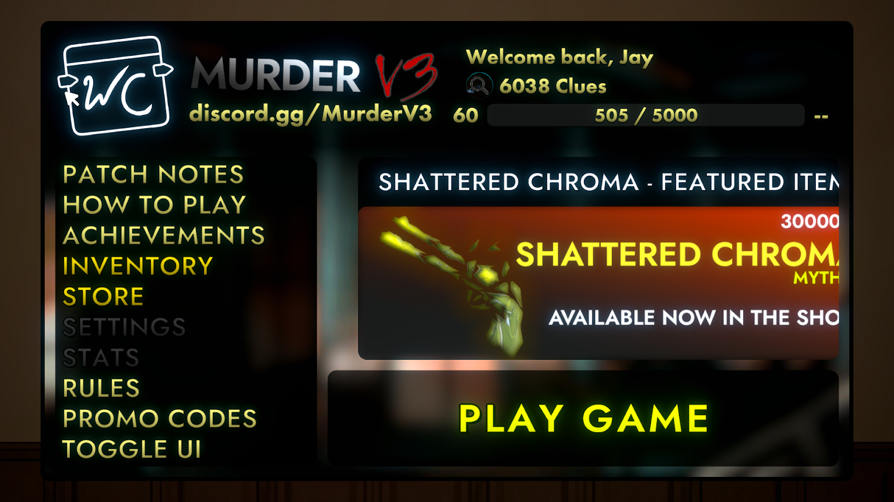
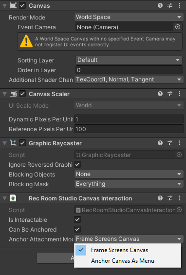
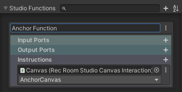
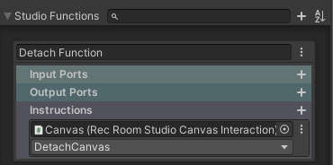

# Anchor Canvas

Use Anchor Canvas functions to create interactive UIs in your rooms with a polished experience for Screens and Mobile players.

## Summary

The “Rec Room Studio Canvas Interaction” component has functionality to anchor a UI canvas to a Screen/Mobile player’s screen, making menus and entire games on a canvas much easier to interact with on those devices. VR is not supported yet, but will be at a later time.

## Making a canvas anchorable

Create a Studio Prop that has a worldspace canvas (click here to learn how). On the canvas object, add the Rec Room Studio Canvas Interaction component. Toggle “Is Interactable'' and “Can Be Anchored”. If Can Be Anchored is set to True, you’ll see a dropdown called “Anchor Attachment Mode” appear with two options.

### Frame Screens Canvas

This is the default option when toggling Can Be Anchored, this will take a screen player’s camera and frame it in front of the canvas while occluding any objects in front, including players. This mode also lets you use your watch while anchoring, but will unanchor you if you open your watch while anchored. You can exit anchor mode by pressing the exit button on your platform, or clicking on the edges outside of the canvas. We recommend this mode for more important menu UIs, or entire games.

### Anchor Canvas As Menu

This option will instead move the canvas over to the player and will “fullscreen” it, similar to when you use the watch. There is no transition time and it is instant. You can exit anchor mode by pressing the exit button on your platform, or clicking on the edges outside of the canvas. You cannot use the watch while in this mode and anchoring while your watch is open will fail to anchor, meaning you would have to try again. You can use the Get.IsAnchored property to see if anchoring failed because a player’s watch was open. We recommend this mode for small menu UIs.

### Setting up an anchor function

Create a new Studio Function (click here to learn how), drag the “Canvas” object into your instruction and under “RecRoomStudioCanvasInteraction” select the “AnchorCanvas” method. When executed in-game via a Studio Function chip, this will anchor your canvas in the selected mode.

### Setting up a detach function

Create a new Studio Function (click here to learn how), drag the “Canvas” object into your instruction and under “RecRoomStudioCanvasInteraction” select the “DetachCanvas” method. When executed in-game via a Studio Function chip, this will detach your canvas and return control to the player’s avatar.

